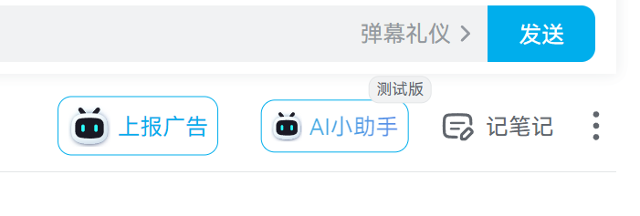
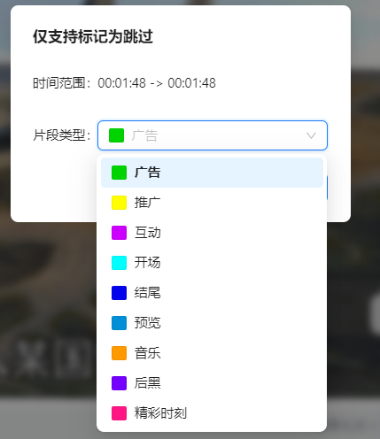

  

- 1.旨在实现纯净的Bilibili观看体验，功能借鉴和后端数据都来自致谢中两个仓库
- 2.通过vite+react+typescript构建（采用react主要是为了后期做一些页面上的功能扩展）
- 3.通过vite-plugin-monkey实现的build成tampermonkey上运行的用户脚本，为了少装扩展和足够轻量化
- 4.yarn build后在dist后生成的js在油猴安装即可使用，或者在[greasyfork](https://greasyfork.org/zh-CN/scripts/571063-bilicleaner)直接安装
- 5.目前已实现如下：
  1. 识别到后端的片段后自动跳过（改用了interval实现，原版是监听的timeupdate）
  2. 将上报片段按钮放到了右下角，为了醒目样式复用了官方AI机器人  

#### 致谢

感谢[ajayyy](https://github.com/ajayyy)的[SponsorBlock](https://github.com/ajayyy/SponsorBlock)和[hanydd](https://github.com/hanydd)的[BilibiliSponsorBlock](https://github.com/hanydd/BilibiliSponsorBlock)

#### 开源协议

本项目遵循 GNU GPL v3 开源协议。